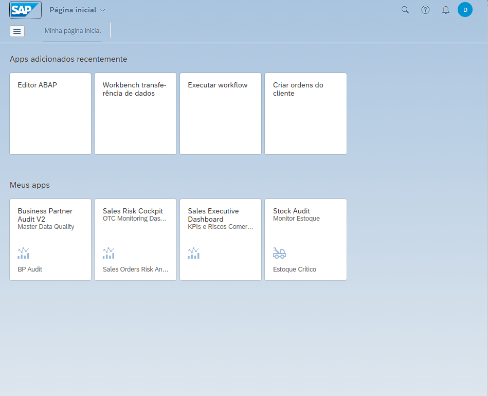
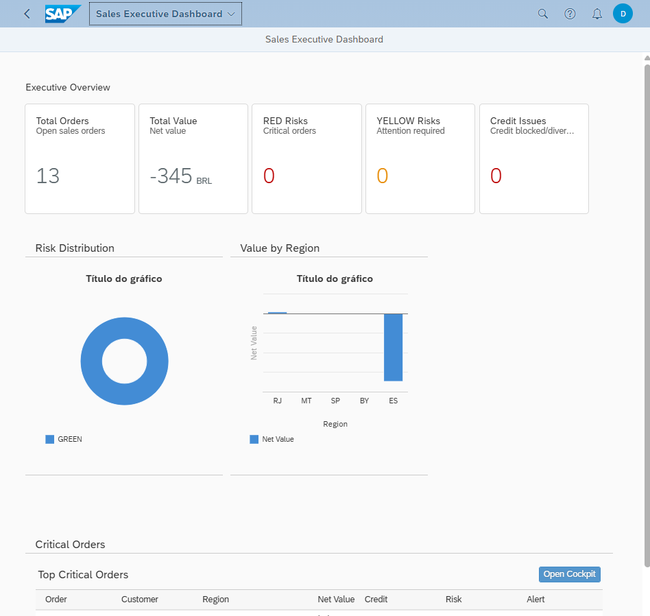
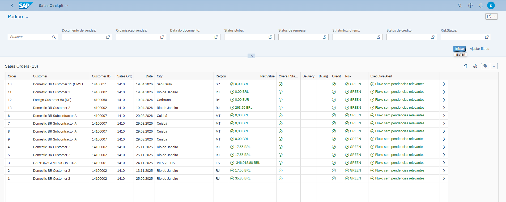

# SAP S/4HANA Portfolio

Portfólio SAP organizado para demonstrar entregas end-to-end com **ABAP CDS**, **OData V4**, **SAP Fiori**, **VS Code** e **SAP Launchpad**.

## Projetos em destaque

### 1. Stock Audit Dashboard
Aplicação SAP Fiori para auditoria de estoque por material, centro e depósito, com foco em valuation, preços e consistência operacional.

### 2. Business Partner Audit V2
Projeto voltado à auditoria de dados mestres de BP para suportar fluxos MM, SD e FI.

### 3. Sales Risk Cockpit
Cockpit para monitoramento de risco no processo OTC, com análise de pedidos, crédito e alertas executivos.

### 4. Sales Executive Dashboard
Dashboard executivo SAP com KPIs, distribuição de riscos e visão gerencial.

---

## Stack principal

- SAP S/4HANA
- ABAP CDS Views
- Eclipse / ADT
- OData V4
- SAP Fiori Elements
- VS Code
- SAP Launchpad

---

## Estrutura do repositório

```text
sap-s4hana-portfolio/
├── README.md
├── screenshots/
├── projects/
│   ├── stock-audit-dashboard/
│   ├── bp-audit-v2/
│   ├── sales-risk-cockpit/
│   └── sales-executive-dashboard/
├── docs/
│   ├── architecture/
│   ├── implementation-guides/
│   ├── eclipse/
│   ├── vscode/
│   └── launchpad/
└── linkedin/
```

---

## Screenshots

### SAP Fiori Launchpad


### Sales Executive Dashboard


### Sales Orders Monitor


---

## Objetivo do portfólio

Demonstrar capacidade real de construir soluções SAP do backend ao frontend:

1. Modelagem com CDS Views  
2. Exposição via OData V4  
3. Consumo com SAP Fiori  
4. Publicação no Launchpad  
5. Organização profissional para GitHub e LinkedIn

---

## Autor

**Samuel Ramos**
