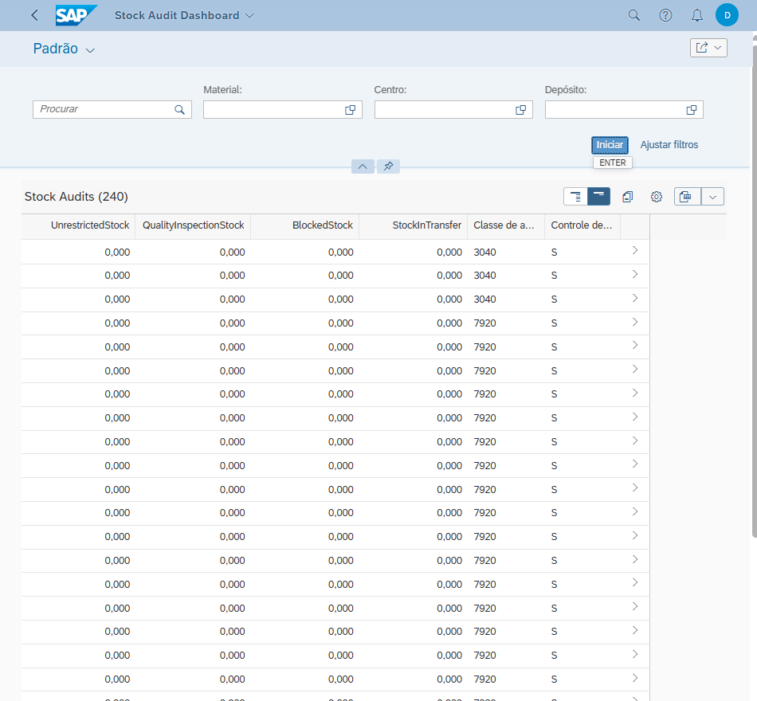
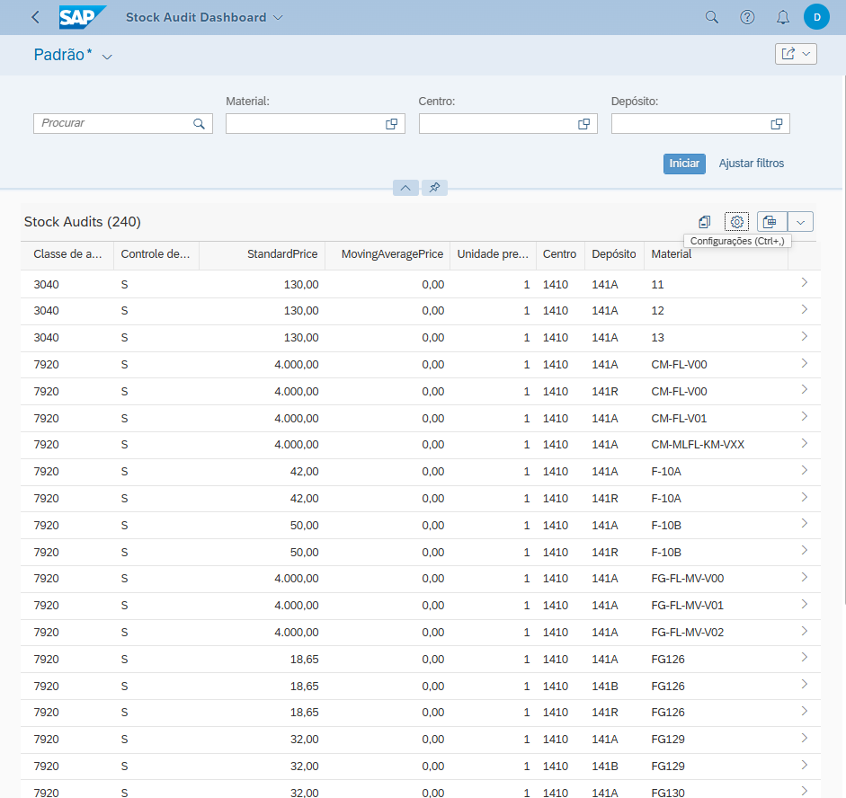
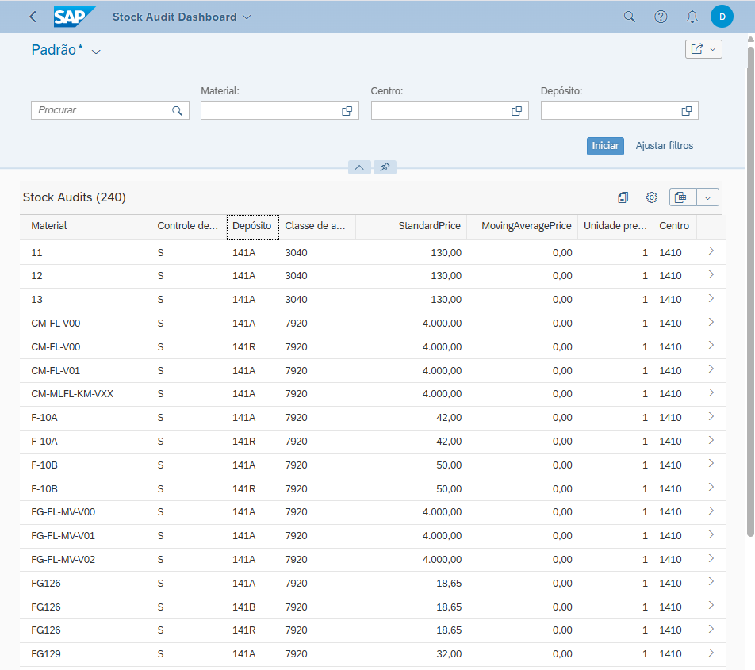

# Stock Audit Dashboard

Aplicação SAP Fiori para auditoria de estoque no SAP S/4HANA.

## Objetivo
Gerar visibilidade operacional e contábil sobre estoque por material, centro e depósito.

## Stack
- ABAP CDS Views
- Eclipse / ADT
- OData V4
- SAP Fiori Elements
- VS Code
- SAP Launchpad

## Funcionalidades
- Filtros por Material, Centro e Depósito
- Análise de Standard Price vs Moving Average Price
- Visão por valuation class
- Navegação no SAP Fiori Launchpad

## Screenshots

### Visão geral

### Colunas e estrutura

### Material em destaque

## Estrutura técnica
- `cds/`: views e modelagem
- `odata/`: service definition e binding
- `fiori/`: configurações do app
- `screenshots/`: imagens do projeto
